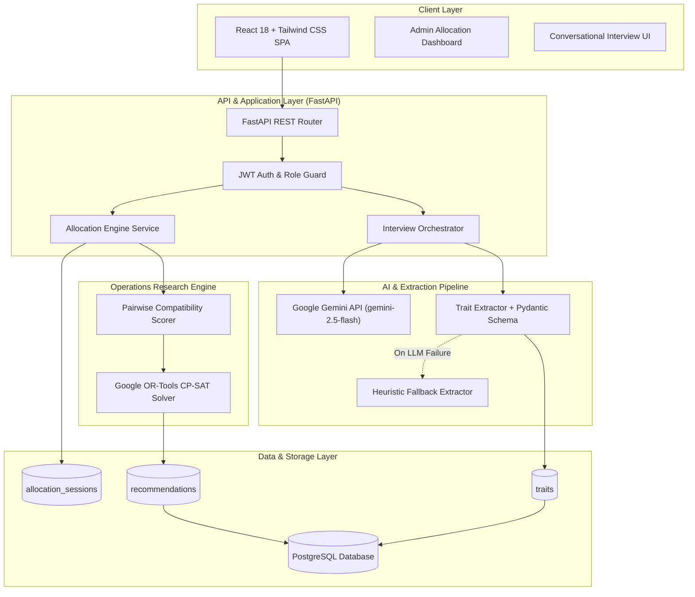
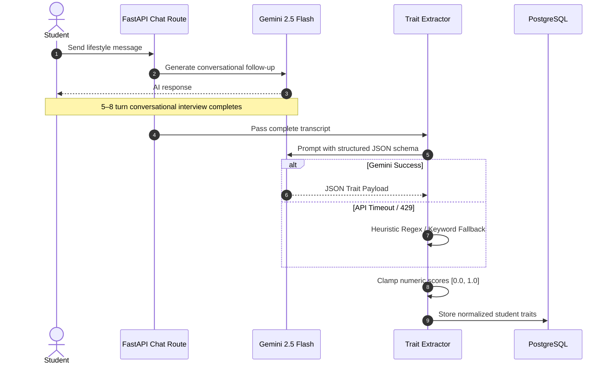
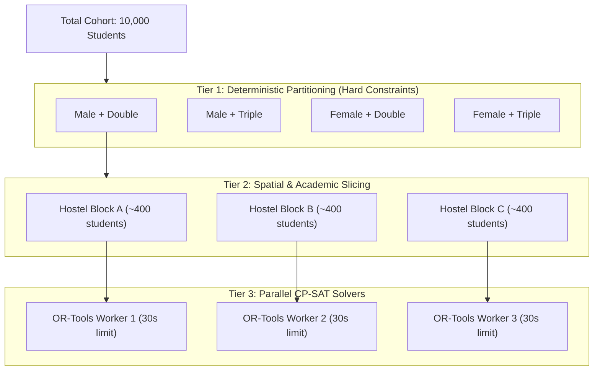

# 📐 CoHabit-AI System Design & Architecture Document

This document outlines the architectural patterns, mathematical formulations, scalability bottlenecks, and distributed system strategies underpinning **CoHabit-AI**.

---

## 1. High-Level System Architecture



---

## 2. Core Subsystems

### 2.1 AI Interview & Trait Extraction Pipeline
* **Component Path:** `backend/ai/interview_bot.py`, `backend/ai/trait_extractor.py`
* **Objective:** Replace static, biased questionnaires with conversational profiling to capture authentic lifestyle habits.



#### Trait Dimensions & Value Normalization
| Trait | Data Type | Range | Meaning |
| :--- | :--- | :--- | :--- |
| `cleanliness` | Float | `0.0 – 1.0` | $0.0$ = Very messy $\leftrightarrow$ $1.0$ = Extremely neat |
| `noise_tolerance` | Float | `0.0 – 1.0` | $0.0$ = Needs absolute silence $\leftrightarrow$ $1.0$ = High tolerance |
| `social_level` | Float | `0.0 – 1.0` | $0.0$ = Extreme introvert $\leftrightarrow$ $1.0$ = Extreme extrovert |
| `sleep_time` | String | Normalized Minutes ($0\text{--}1439$) | Typical bedtime (e.g., "23:00", "11pm") |
| `wake_time` | String | Normalized Minutes ($0\text{--}1439$) | Typical wake time (e.g., "07:00", "7am") |
| `preferred_room_size` | Integer | `1, 2, 3, 4` | Room capacity (Single, Double, Triple, Quad) |

---

### 2.2 Compatibility Scoring Engine
* **Component Path:** `backend/ml/scorer.py`
* **Scoring Range:** `0.0` to `100.0` points.

#### Time Difference Normalization (Circular Arithmetic)
Standard Euclidean distance between bedtimes fails at midnight (e.g., $23:00$ vs $01:00$ appears as 22 hours difference). CoHabit-AI normalizes time strings to minutes from midnight ($0 \le t < 1440$) and applies circular delta arithmetic:

$$\Delta t = \min(|t_1 - t_2|, 1440 - |t_1 - t_2|)$$

Penalty scales linearly up to 180 minutes (3 hours):
$$\text{Penalty}_{\text{time}} = \min\left(\frac{\Delta t}{180.0}, 1.0\right) \times 15.0$$

#### Scoring Breakdown
* **Cleanliness (20%):** $-20 \times |c_1 - c_2|$
* **Noise Tolerance (20%):** $-20 \times |n_1 - n_2|$
* **Sleep Time (15%):** Circular time penalty (up to 15 pts)
* **Wake Time (15%):** Circular time penalty (up to 15 pts)
* **Study Style (20%):** Keyword clustering match (Silent vs. Group/Ambient)
* **Sociability (10%):** $-10 \times |s_1 - s_2|$

---

### 2.3 Mathematical Optimization Engine (OR-Tools CP-SAT)
* **Component Path:** `backend/ml/allocator.py`
* **Formulation:** Capacitated Room Assignment with Quadratic Cohabitation Utility.

#### 1. Decision Variables
Let $S = \{0, \dots, n-1\}$ be students and $R = \{0, \dots, m-1\}$ be available rooms:
$$x_{s,r} \in \{0, 1\} \quad \forall s \in S, r \in R$$
*(1 if student $s$ is placed in room $r$, 0 otherwise)*

#### 2. Hard Constraints
1. **Assignment Uniqueness:** Each student is placed in exactly one room:
   $$\sum_{r \in R} x_{s,r} = 1 \quad \forall s \in S$$

2. **Room Capacity Limit:** Total students in room $r$ cannot exceed capacity $C$:
   $$\sum_{s \in S} x_{s,r} \le C \quad \forall r \in R$$

3. **Symmetry Breaking:** Rooms of equal capacity are indistinguishable. To prevent the solver from exploring redundant permutations, enforce monotone occupancy:
   $$\sum_{s \in S} x_{s,r} \le \sum_{s \in S} x_{s, r-1} \quad \forall r \in \{1, \dots, m-1\}$$

#### 3. Linearization of Quadratic Cohabitation Objective
Maximizing total roommate compatibility requires scoring student $i$ and $j$ if and only if both reside in room $r$:
$$\max \sum_{i < j} \sum_{r \in R} \text{Score}(i,j) \cdot (x_{i,r} \cdot x_{j,r})$$

Because $x_{i,r} \cdot x_{j,r}$ is non-linear, we introduce auxiliary boolean variables $b_{i,j,r} \in \{0, 1\}$:
$$b_{i,j,r} \le x_{i,r}$$
$$b_{i,j,r} \le x_{j,r}$$
$$b_{i,j,r} \ge x_{i,r} + x_{j,r} - 1$$

Objective function passed to the CP-SAT solver:
$$\max \sum_{i < j} \sum_{r \in R} \lfloor \text{Score}(i,j) \times 100 \rfloor \cdot b_{i,j,r}$$

---

## 3. Scalability & System Bottlenecks

### 3.1 The $O(N^2 \cdot R)$ Complexity Challenge
In a naive single-solver formulation:
* For $N = 2,000$ students and room capacity $C=2$ ($R = 1,000$ rooms):
  * Pairwise terms: $\frac{N(N-1)}{2} \approx 2 \times 10^6$ pairs.
  * Linearized boolean variables: $2 \times 10^6 \times 1,000 = 2 \times 10^9$ variables.
* **Bottleneck:** A single CP-SAT model cannot fit in memory and will exceed CPU time bounds.

### 3.2 Scaling Architecture: Multi-Tier Partitioning



1. **Deterministic Slicing (Already Implemented):**
   * Students are partitioned by `(Gender, Preferred Room Size)`.
   * A 10,000 student problem decomposes into smaller independent sub-problems.
2. **Spatial / Departmental Slicing:**
   * Partition further by College / Campus / Hostel Block.
3. **Graph Clustering (For clusters $> 1,000$ students):**
   * Apply Louvain Community Detection or K-Means on trait vectors to segment into 300-student pods before CP-SAT optimization.

---

## 4. Production Asynchronous Task Architecture

Running solver tasks within synchronous FastAPI request loops causes HTTP 504 timeouts. The production-ready design employs a decoupled task worker:

```mermaid
flowchart LR
    Admin([Admin User]) -->|POST /api/allocations/run| API[FastAPI Gateway]
    API -->|1. Create session (status=PENDING)| DB[(PostgreSQL)]
    API -->|2. Push Task ID| Redis[(Redis Job Queue)]
    API -->>|3. 202 Accepted {job_id}| Admin

    subgraph Workers ["Celery / RQ Worker Pool"]
        W1[Worker Core 1]
        W2[Worker Core 2]
    end

    Redis -->|Consume Task| W1
    W1 -->|Execute OR-Tools CP-SAT| W1
    W1 -->|4. Update status=COMPLETED| DB

    Admin -->|Poll GET /api/allocations/:id/status| API
    API -->|Read status & results| DB
```

---

## 5. Fault Tolerance & Reliability Patterns

| Failure Mode | Impact | Mitigation Strategy |
| :--- | :--- | :--- |
| **Gemini Quota / 429 Rate Limit** | AI interview fails to produce traits | Circuit breaker triggers rule-based heuristic extractor (`backend/ai/trait_extractor.py`) without blocking student flow. |
| **Malformed LLM Output** | Invalid JSON crashes trait parser | Strip markdown code fences $\rightarrow$ Pydantic schema validation $\rightarrow$ Regex fallback $\rightarrow$ Default clamp `[0.0, 1.0]`. |
| **Concurrent Admin Triggers** | Double allocation runs for same session | Database row-level locking (`SELECT ... FOR UPDATE`) and atomic state check `UPDATE ... WHERE status = 'PENDING'`. |
| **Solver Infeasibility** | Room count shortage | Soft fallback relaxes symmetry constraints and reports unallocated students cleanly via `unallocated_students` metadata. |

---

## 6. Interview Quick Reference Sheet

* **Q: Why CP-SAT instead of Gale-Shapley?**
  * *A:* Gale-Shapley addresses 1:1 bipartite stable matching. CoHabit-AI solves multi-occupancy capacitated bin-packing with global utility optimization under strict resource bounds.
* **Q: How are symmetrical rooms handled?**
  * *A:* Symmetry breaking constraints ($\sum x_{s,r} \le \sum x_{s,r-1}$) enforce filling lower-indexed rooms first, pruning $R!$ redundant search tree branches.
* **Q: How is circular bedtime handled?**
  * *A:* Time normalized to minutes since midnight, applying $\Delta t = \min(|t_1 - t_2|, 1440 - |t_1 - t_2|)$.
